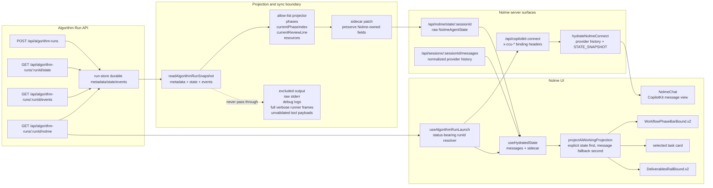
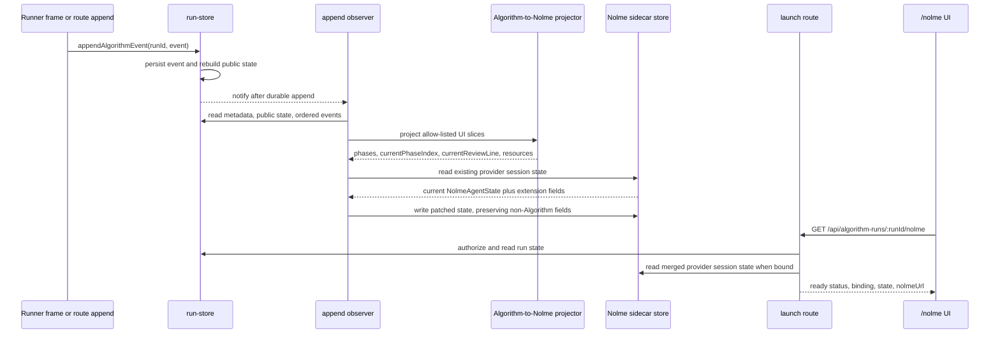
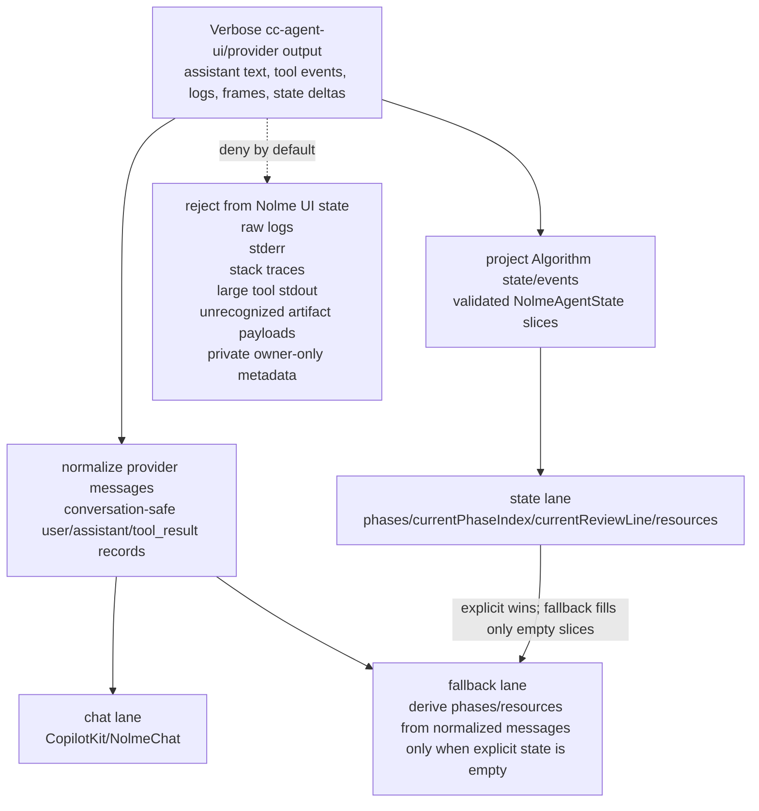
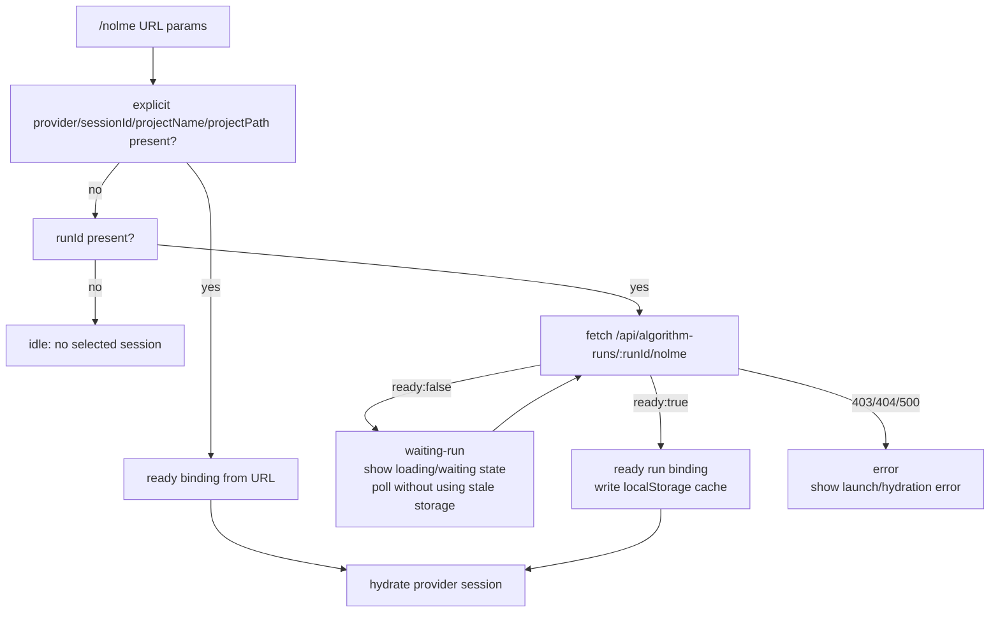
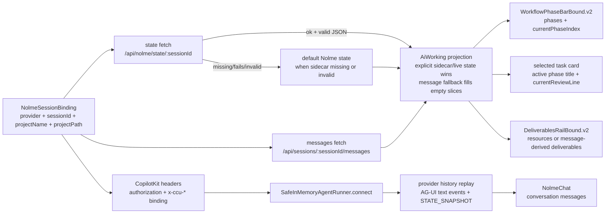

# Algorithm Run API to Nolme UI TDD Implementation Plan

## Overview

Connect the implemented Algorithm Run API to `/nolme` by test-driving the smallest observable path from an Algorithm run to a populated Nolme workspace:

- a run resolves to the provider session Nolme already hydrates from;
- Algorithm phase/status/artifact signals project into `NolmeAgentState`;
- the projected Algorithm-owned slices are merged into the provider session sidecar without overwriting Nolme-owned fields;
- `/nolme/?runId=<runId>` can resolve the normal Nolme session binding while representing waiting/error states explicitly;
- CopilotKit reconnect for a fresh `/nolme` page replays provider history through the production runner connect path instead of depending only on in-memory runtime history.

The end state should make `/nolme` show chat history, phase pills, selected task details, and deliverables for a bound Algorithm run without making the Algorithm run id become the Nolme thread id.

## Review Resolution Summary

This revision incorporates the blocking findings from `2026-04-27-cam-11u-tdd-algorithm-run-api-nolme-connection-REVIEW.md`:

- Sidecar sync is now a patch contract. Algorithm owns only `phases`, `currentPhaseIndex`, `currentReviewLine`, and `resources`; all Nolme-owned and extension fields are preserved.
- Sync is now driven by a non-circular run-store append observer after durable event persistence, covering direct route appends and runner frame appends.
- Projection now consumes `{ metadata, state, events }` and writes only validated Algorithm-owned slices, with resource defaults matching `normalizeNolmeState()`.
- The launch route remains an Algorithm-envelope endpoint; `/api/nolme/state/:sessionId` remains raw-state-compatible.
- `/nolme/?runId=` now requires a status-bearing resolver with explicit precedence over localStorage and BroadcastChannel while run-launch mode is active.
- CopilotKit reconnect now targets the real `AgentRunnerConnectRequest` surface: forwarded `x-ccu-*` headers parsed into a binding and passed to a shared provider-history hydration helper.
- Invalid/missing connect binding headers now delegate to `super.connect(request)`.
- `useHydratedState()` now has a regression requirement that sidecar fetch/parse failures preserve message hydration and fallback projections.

## Current State Analysis

### Key Discoveries

- `POST /api/algorithm-runs` returns state/events links only; `startResponse()` has no Nolme link or launch contract yet (`server/routes/algorithm-runs.js:79`).
- Algorithm state/events routes exist and are owner-authorized (`server/routes/algorithm-runs.js:164`, `server/routes/algorithm-runs.js:176`).
- Public Algorithm state contains `runId`, `provider`, `model`, `status`, `sessionId`, `phase`, cursor, pending decision fields, and timestamps, but no `phases`, `currentReviewLine`, or `resources` (`server/algorithm-runs/run-store.js:76`).
- `persistRunnerFrame()` currently maps runner `state` frames only to `algorithm.session.bound`, `algorithm.phase.changed`, and `algorithm.status.changed` (`server/algorithm-runs/run-store.js:412`).
- `AlgorithmRunEvent` types do not include resource/artifact events (`server/algorithm-runs/contracts.js:22`).
- Nolme binding already has the required provider session fields: `provider`, `sessionId`, `projectName`, `projectPath`, with optional model and permission fields (`nolme-ui/src/lib/types.ts:20`).
- Nolme rails render from `NolmeAgentState.phases`, `currentPhaseIndex`, `currentReviewLine`, and `resources` (`nolme-ui/src/lib/types.ts:63`).
- `useCcuSession()` reads a normal session binding from URL, localStorage, or `BroadcastChannel('ccu-session')`; it does not understand `runId` (`nolme-ui/src/hooks/useCcuSession.ts:21`).
- `useHydratedState()` fetches `/api/sessions/:sessionId/messages` and `/api/nolme/state/:sessionId`, then returns hydrated messages and normalized state (`nolme-ui/src/hooks/useHydratedState.ts:31`, `nolme-ui/src/hooks/useHydratedState.ts:63`).
- `projectAiWorkingProjection()` already gives explicit sidecar/live state precedence, then fills missing phase/resource slices from message history (`nolme-ui/src/lib/ai-working/projectAiWorkingProjection.ts:117`).
- `projectPhaseTimeline()` already understands workflow-tool `setPhaseState`/`advancePhase` history and algorithm header fallback (`nolme-ui/src/lib/ai-working/projectPhaseTimeline.ts:352`, `nolme-ui/src/lib/ai-working/projectPhaseTimeline.ts:550`).
- `projectDeliverables()` already derives deliverables from `tool_result.toolUseResult.filePath`, `addResource`, or a `COMPLETED:` summary (`nolme-ui/src/lib/ai-working/projectDeliverables.ts:240`).
- The V2 phase and deliverable bindings are thin state-to-UI adapters and should not be first targets (`nolme-ui/src/components/bindings/WorkflowPhaseBarBound.v2.tsx:4`, `nolme-ui/src/components/bindings/DeliverablesRailBound.v2.tsx:11`).
- `CcuSessionAgent.connect()` is capable of fetching provider history and emitting `STATE_SNAPSHOT` (`server/agents/ccu-session-agent.js:291`).
- Production CopilotKit connect goes through `handleSseConnect -> runtime.runner.connect(...)`, not `agent.connect(...)` (`node_modules/@copilotkit/runtime/src/v2/runtime/handlers/sse/connect.ts:12`).
- `InMemoryAgentRunner.connect()` emits nothing when no in-memory store exists for the thread (`node_modules/@copilotkit/runtime/src/v2/runtime/runner/in-memory.ts:294`).
- `SafeInMemoryAgentRunner.connect()` currently only prunes bad in-memory history and delegates to `super.connect()` (`server/lib/safe-in-memory-agent-runner.js:30`).
- `NolmeChat` renders CopilotKit's chat component by thread id; it does not receive `useHydratedState().messages` directly (`nolme-ui/src/components/NolmeChat.tsx:22`).
- `writeState(binding, state)` writes the whole Nolme sidecar payload, so Algorithm sync must first `readState(binding)` and patch only Algorithm-owned slices (`server/agents/nolme-state-store.js:131`).
- The existing sidecar can also contain profile, quick actions, task notifications, token budget, and active skill context, and those fields are not owned by Algorithm sync (`nolme-ui/src/lib/ai-working/normalizeNolmeState.ts:185`).
- `normalizeNolmeState()` defaults invalid resource badges to `P1`, invalid tones from badge, and invalid actions to `download`; server projection must mirror those defaults before writing Algorithm sidecar slices (`nolme-ui/src/lib/ai-working/normalizeNolmeState.ts:74`).
- `normalizeNolmeState()` currently treats raw non-empty phase/resource arrays as explicit even if normalization drops their entries, so Algorithm sync must guarantee it never writes malformed non-empty arrays (`nolme-ui/src/lib/ai-working/normalizeNolmeState.ts:207`).
- CopilotKit connect receives only `threadId`, optional `headers`, and optional `joinCode`; there is no connect-time `agent` or `forwardedProps` contract (`node_modules/@copilotkit/runtime/src/v2/runtime/runner/agent-runner.ts:17`).
- CopilotKit forwards only `authorization` and `x-*` headers into runner connect, which makes `x-ccu-*` the required binding propagation surface (`node_modules/@copilotkit/runtime/src/v2/runtime/handlers/header-utils.ts:5`).
- `NolmeApp` currently passes the binding through CopilotKit `properties`, which helps run calls but does not make the binding available to the production connect path (`nolme-ui/src/NolmeApp.tsx:126`).

## Desired End State

Given an Algorithm run id, `/nolme` can resolve a normal `NolmeSessionBinding` once `AlgorithmRunState.sessionId` is available. The server merges compatible Algorithm-owned `NolmeAgentState` slices into that provider session sidecar whenever runner frames or run events contain phase/review/resource information. The UI hydrates the provider session from existing message and state endpoints, and CopilotKit connect replays provider history on a fresh page load.

### Observable Behaviors

1. Given Algorithm state/events with phase information, when the projection runs, then it returns a valid `NolmeAgentState` phase list, active index, review line, and terminal completion state.
2. Given Algorithm state/events with resource/artifact information, when the projection runs, then it returns normalized Nolme resources without breaking the existing message fallback.
3. Given a bound Algorithm run, when the server syncs the run to Nolme, then only `phases`, `currentPhaseIndex`, `currentReviewLine`, and `resources` are patched into the provider session sidecar at the same location `/api/nolme/state/:sessionId` already reads.
4. Given an authenticated bound Algorithm run id, when `/api/algorithm-runs/:runId/nolme` is called, then it returns the normal Nolme binding, the merged Nolme state visible to that session, and `/nolme/?runId=<runId>` launch URL.
5. Given `/nolme/?runId=<runId>`, when the launch endpoint reports the run is waiting, ready, or errored, then the Nolme session resolver returns a status-bearing result rather than collapsing every non-ready state to "No session selected".
6. Given a fresh `/nolme` page with no CopilotKit in-memory history, when CopilotKit connect runs with valid `x-ccu-*` binding headers, then provider history and sidecar state are emitted instead of an empty stream.
7. Given the resolved run launch and provider history, when the Nolme dashboard renders, then the chat column, phase bar, selected task card, and deliverables rail are populated.
8. Given Nolme message history exists but sidecar state is missing, non-OK, network-failed, or invalid JSON, when hydration runs, then messages still hydrate and ai-working projections fall back to defaults/message-derived state.

## What We're NOT Doing

- Not changing `NolmeAgentState` field names or V2 rail component props.
- Not using Algorithm `runId` as CopilotKit `threadId`; Nolme remains bound to provider `sessionId`.
- Not making `/nolme` read private Algorithm run store files directly.
- Not depending on private core fields, raw stderr, or arbitrary client-supplied paths.
- Not replacing message-history fallback projection; explicit Algorithm-projected sidecar state only fills the existing explicit state channel.
- Not solving multi-process sidecar locking beyond the current file-store behavior.
- Not changing `/api/nolme/state/:sessionId` to the Algorithm `{ ok, schemaVersion }` envelope; that endpoint must keep returning raw Nolme state because `useHydratedState()` expects raw state.
- Not allowing Algorithm sync to overwrite Nolme-owned sidecar fields such as `profile`, `quickActions`, `taskNotifications`, `tokenBudget`, or `activeSkill`.

## System Diagrams

These diagrams make the output boundary explicit. `cc-agent-ui` and provider histories can be verbose; Nolme UI should receive only normalized chat messages plus the allow-listed `NolmeAgentState` slices needed by its components.

### Run API To Nolme State System



### Server Sync Sequence



### Output Filtering Contract



## UI Flow Diagrams

### `runId` Launch Resolution



### Hydration And Component Wiring



### Component Source Map

| UI surface | Primary source | Fields consumed | Allowed LLM/provider output | Must not display |
| --- | --- | --- | --- | --- |
| `NolmeChat` | CopilotKit connect replay and normalized `/api/sessions/:sessionId/messages` history | conversation messages for the provider `sessionId` | normalized user/assistant text and safe tool-result summaries already accepted by provider-history normalization | Algorithm raw logs, stderr, private run metadata, full runner frames, unbounded tool stdout |
| `WorkflowPhaseBarBound.v2` | `projectAiWorkingProjection()` over sidecar/live `NolmeAgentState` with message fallback | `phases[*].id`, `label`, `title`, `status`, `currentPhaseIndex` | validated phase labels/statuses from Algorithm phase events or workflow message fallback | arbitrary assistant prose, malformed phase arrays, unknown verbose phase diagnostics |
| Selected task card in `NolmeDashboard.v2` | same projected `NolmeAgentState` | `phases[currentPhaseIndex].title`, `currentReviewLine` | concise current task/review line from phase payloads or workflow projection fallback | full transcript excerpts, raw planning logs, stack traces, internal tool arguments |
| `DeliverablesRailBound.v2` | projected `resources`; fallback from `projectDeliverables(messages)` only when explicit resources are empty | `resources[*].id`, `badge`, `title`, `subtitle`, `tone`, `action`, `url` | explicit validated artifacts, `addResource`, safe `tool_result.toolUseResult.filePath`, or latest `COMPLETED:` summary | every file path seen in logs, raw tool outputs, unvalidated URLs, private local paths unrelated to deliverables |
| Launch/loading/no-session state | `CcuSessionResolution` from URL, launch route, storage, and broadcast precedence | `status`, `source`, `binding`, `runStatus`, `error` | ready/waiting/error status and owner-authorized binding from launch route | stale localStorage or BroadcastChannel binding while URL `runId` mode is active |
| CopilotKit provider props | resolved `NolmeSessionBinding` plus auth context | `Authorization`, `x-ccu-provider`, `x-ccu-session-id`, `x-ccu-project-name`, `x-ccu-project-path`, optional model/permission/run id | encoded binding headers needed for server replay | binding values from arbitrary client paths or non-owner Algorithm runs |

## Resource Registry And Schema Binding

`specs/schemas/resource_registry.json` is absent in this checkout, and no `schema/`, `schemas/`, or `specs/schemas/` directories are present. All UUIDs below are proposed placeholders that must be replaced if a canonical registry appears.

Schema loop result:

- `schema/`: absent.
- `schemas/`: absent.
- `specs/schemas/`: absent.
- Existing schema-like contracts used for planning: `server/algorithm-runs/contracts.js`, `server/tools/workflow-phase-tools.js`, `nolme-ui/src/lib/types.ts`, `nolme-ui/src/lib/ai-working/types.ts`.

No verified TLA+ model exists for this connection path in the checkout. Schema references below are marked `N/A` plus the concrete JS/TS contract source used for the behavior.

## Testing Strategy

- Framework: Vitest for server and UI; React Testing Library for hooks/components.
- Server unit tests: pure Algorithm-to-Nolme projection and connect-binding/header parsing.
- Server integration tests: algorithm run route, run-store append observer sync, real Nolme sidecar write/read path, CopilotKit runner connect fallback.
- UI hook tests: status-bearing `runId` launch resolution in `useCcuSession` or a new hook it composes.
- UI component tests: existing hydration/projection dashboard tests extended with run-launch inputs.
- UI source-map tests: for each surface in the Component Source Map, include one allowed value and at least one denied verbose-output sentinel, then assert the allowed value renders and the denied sentinel does not render.
- Output-filtering tests: projector tests must prove malformed or unknown Algorithm payloads become empty validated slices, while UI fallback tests must prove only normalized provider messages can produce fallback phases/resources.
- Regression tests: existing Algorithm API tests, Nolme hydration/projection tests, malformed sidecar fallback tests, and CopilotKit route auth tests.

Run focused tests after each behavior, then:

```bash
npm test -- tests/generated/test_algorithm_run_store.spec.ts tests/generated/test_algorithm_runs_route_state_events.spec.ts
npm test -- tests/generated/test_copilotkit_route_auth.spec.ts tests/generated/test_safe_in_memory_agent_runner.spec.ts tests/generated/test_ccu_session_agent_hydration.spec.ts
npm --prefix nolme-ui test -- tests/generated/test_use_hydrated_state.spec.tsx tests/generated/ai-working/P0_projection_boundary.spec.ts tests/generated/ai-working/P1_merge_precedence.spec.ts
npm --prefix nolme-ui test -- tests/generated/test_algorithm_run_launch_binding.spec.tsx tests/generated/nolme-chat/J1_hydration_replay.spec.tsx
npm run typecheck
npm --prefix nolme-ui run typecheck
```

## Behavior 1: Project Algorithm Phase State To Nolme Phases

### Resource Registry Binding

- `resource_id`: `[PROPOSED] 9fbdb725-1ddf-4d46-b995-c8cb15303511`
- `address_alias`: `algorithm.nolme_phase_projection`
- `predicate_refs`: Algorithm run metadata plus public state and ordered events; metadata supplies `projectPath`/provider context that public state intentionally omits.
- `codepath_ref`: `[PROPOSED] server/algorithm-runs/nolme-projection.js::projectAlgorithmRunToNolmeState`
- `schema_contract_refs`: `N/A`; uses `server/algorithm-runs/contracts.js::AlgorithmRunState` and `nolme-ui/src/lib/types.ts::NolmeAgentState`.

### Schema Interface Mapping

- `loop_mode`: `low_context_detail`
- `mapped_contracts`: `{ metadata, state, events }` -> Algorithm-owned `NolmeAgentState` slices: `phases/currentPhaseIndex/currentReviewLine`.
- `registry_updates`: add `schema_refs` to the proposed registry entry when the canonical registry exists.

### Test Specification

Given an Algorithm state with `phase: "plan"` and status `running`, when projection executes, then it returns Nolme phases ordered by the bridge catalog with prior phases `complete`, `Plan` `active`, later phases `idle`, `currentPhaseIndex` pointing to Plan, and a non-empty review line if the latest phase payload supplies one.

Given a terminal `completed` status, when projection executes, then all phases are `complete` and `currentPhaseIndex` points at the final phase.

Edge cases:

- unknown phase string maps to a single active humanized phase instead of empty state;
- null phase returns default empty phases unless a richer phase catalog is present in events;
- invalid phase catalog entries are dropped;
- `currentPhaseIndex` is clamped to the projected phase list;
- terminal failed/cancelled runs do not incorrectly mark every phase complete.
- malformed non-empty phase arrays are never written; invalid entries are dropped and an all-invalid phase payload projects to an empty `phases` slice so UI message fallback is not suppressed by Algorithm sync.

### TDD Cycle

#### Red: Write Failing Tests

File: `tests/generated/test_algorithm_nolme_projection.spec.ts`

```ts
describe('projectAlgorithmRunToNolmeState phase projection', () => {
  it('marks previous catalog phases complete and the current Algorithm phase active', () => {
    // state.phase = 'plan'; assert Observe/Think complete, Plan active.
  });

  it('marks all projected phases complete only for completed runs', () => {
    // status = 'completed'; assert every phase is complete.
  });

  it('uses event review-line payloads for currentReviewLine', () => {
    // latest algorithm.phase.changed payload has currentReviewLine.
  });

  it('drops malformed phase payloads instead of writing invalid explicit arrays', () => {
    // invalid catalog entries produce phases: [] and currentPhaseIndex: 0.
  });
});
```

#### Green: Minimal Implementation

File: `server/algorithm-runs/nolme-projection.js`

```js
/**
 * @rr.id 9fbdb725-1ddf-4d46-b995-c8cb15303511
 * @rr.alias algorithm.nolme_phase_projection
 * @path.id project-algorithm-phase-to-nolme-state
 * @gwt.given an Algorithm run state and its ordered event log
 * @gwt.when projectAlgorithmRunToNolmeState executes
 * @gwt.then Nolme phases, active index, and review line are derived deterministically
 * @reads 9fbdb725-1ddf-4d46-b995-c8cb15303511
 * @writes 3ebb7305-7e3b-41ba-9282-f7d12b601d3b
 * @raises invalid_request:InvalidAlgorithmNolmeProjectionInput
 * @schema.contract N/A; server/algorithm-runs/contracts.js::AlgorithmRunState, nolme-ui/src/lib/types.ts::NolmeAgentState
 */
export function projectAlgorithmRunToNolmeState({ metadata, state, events }) {
  return {
    phases: [],
    currentPhaseIndex: 0,
    currentReviewLine: '',
    resources: [],
  };
}
```

#### Refactor

- Extract a small server-owned phase catalog matching Nolme's Observe/Think/Plan/Build/Execute/Verify/Learn names.
- Normalize phase ids with the same case-insensitive tolerance as `projectPhaseTimeline()`.
- Keep this module dependency-light; do not import React or Nolme UI code into the server.
- Keep the projector restricted to Algorithm-owned slices; sidecar merge code owns preserving Nolme-owned fields.

### Success Criteria

Automated:

- `npm test -- tests/generated/test_algorithm_nolme_projection.spec.ts`

Manual:

- A sampled run with `phase: "plan"` yields a sidecar shape accepted by `/api/nolme/state/:sessionId`.

---

## Behavior 2: Project Algorithm Resources To Nolme Deliverables

### Resource Registry Binding

- `resource_id`: `[PROPOSED] 3ebb7305-7e3b-41ba-9282-f7d12b601d3b`
- `address_alias`: `algorithm.nolme_resource_projection`
- `predicate_refs`: ordered Algorithm events and runner state frames that include resource/artifact payloads.
- `codepath_ref`: `[PROPOSED] server/algorithm-runs/nolme-projection.js::projectAlgorithmRunToNolmeState`
- `schema_contract_refs`: `N/A`; uses `server/tools/workflow-phase-tools.js::addResource` and `nolme-ui/src/lib/types.ts::NolmeResource`.

### Schema Interface Mapping

- `loop_mode`: `low_context_detail`
- `mapped_contracts`: Algorithm resource/artifact event payload -> validated `NolmeResource`.
- `registry_updates`: proposed `algorithm.nolme_resource_projection` entry should reference the eventual artifact event schema.

### Test Specification

Given Algorithm events that include a valid resource payload compatible with Nolme's `addResource` contract, when projection executes, then `state.resources` contains normalized `id`, `badge`, `title`, `subtitle`, `tone`, `action`, and optional `url`.

Given no explicit resources, when projection executes, then it leaves `resources` empty so existing Nolme message-history fallback can still derive deliverables from provider messages.

Validation/defaulting boundary:

- Server projection owns validation for Algorithm-written resources and must write only valid `NolmeResource` rows.
- Invalid/missing `badge` mirrors `normalizeNolmeState()` and defaults to `P1`.
- Invalid/missing `tone` derives from the normalized badge using `P1 -> emerald`, `P2 -> iris`, `P3/P4 -> gold`.
- Invalid/missing `action` defaults to `download`.
- Missing `title` or `subtitle` rejects that resource event entry rather than writing a malformed row.

Edge cases:

- invalid badge defaults to `P1` consistently with `normalizeNolmeState`;
- duplicate resource ids keep the latest event;
- resources from failed runs remain visible if produced before failure;
- URL is optional and never required for `download` resources.
- malformed non-empty resource arrays are never written; an all-invalid resource payload projects to an empty `resources` slice so UI message fallback is not suppressed by Algorithm sync.

### TDD Cycle

#### Red: Write Failing Tests

File: `tests/generated/test_algorithm_nolme_projection.spec.ts`

```ts
describe('projectAlgorithmRunToNolmeState resource projection', () => {
  it('normalizes valid Algorithm resource payloads into Nolme resources', () => {
    // arrange algorithm.resource.added event, assert resources[0].
  });

  it('leaves resources empty when no explicit Algorithm artifact exists', () => {
    // existing message fallback remains UI-side responsibility.
  });

  it('defaults invalid badge, tone, and action consistently with normalizeNolmeState', () => {
    // badge -> P1, tone -> emerald, action -> download.
  });

  it('drops resource entries missing required title or subtitle', () => {
    // all invalid entries produce resources: [].
  });
});
```

File: `tests/generated/test_algorithm_run_store.spec.ts`

```ts
describe('algorithm.resource.added event support', () => {
  it('accepts algorithm.resource.added through appendAlgorithmEvent and rebuildState', async () => {
    // append resource event, force state rebuild/read, assert event log remains valid.
  });

  it('accepts algorithm.resource.added through persistRunnerFrame({ kind: "event" })', async () => {
    // persist runner event frame and assert readAlgorithmEventsSince includes it.
  });
});
```

#### Green: Minimal Implementation

File: `server/algorithm-runs/contracts.js`

```js
export const EVENT_TYPES = Object.freeze([
  // existing event types...
  'algorithm.resource.added',
]);
```

File: `server/algorithm-runs/nolme-projection.js`

```js
/**
 * @rr.id 3ebb7305-7e3b-41ba-9282-f7d12b601d3b
 * @rr.alias algorithm.nolme_resource_projection
 * @path.id project-algorithm-resource-to-nolme-state
 * @gwt.given Algorithm resource events exist for a run
 * @gwt.when projectAlgorithmRunToNolmeState executes
 * @gwt.then resources are projected into NolmeResource rows
 * @reads 3ebb7305-7e3b-41ba-9282-f7d12b601d3b
 * @writes 3ebb7305-7e3b-41ba-9282-f7d12b601d3b
 * @raises invalid_request:InvalidAlgorithmResourcePayload
 * @schema.contract N/A; server/tools/workflow-phase-tools.js::addResource, nolme-ui/src/lib/types.ts::NolmeResource
 */
function projectResources(events) {
  return [];
}
```

#### Refactor

- Keep resource normalization aligned with `normalizeNolmeState()` so the sidecar and UI normalize the same way.
- Add `algorithm.resource.added` only if runner frames can provide explicit artifacts; do not invent resources from logs on the server.

### Success Criteria

Automated:

- `npm test -- tests/generated/test_algorithm_nolme_projection.spec.ts`
- `npm test -- tests/generated/test_algorithm_run_contracts.spec.ts`
- `npm test -- tests/generated/test_algorithm_run_store.spec.ts`

Manual:

- A valid projected resource appears in `/api/nolme/state/:sessionId`.
- `appendAlgorithmEvent()`, state rebuild, and `persistRunnerFrame({ kind: "event" })` all accept and preserve `algorithm.resource.added`.

---

## Behavior 3: Sync Bound Algorithm Runs Into The Nolme Sidecar

### Resource Registry Binding

- `resource_id`: `[PROPOSED] 948658d5-1e47-4f6f-b426-dc63a7547ba7`
- `address_alias`: `algorithm.nolme_sidecar_sync`
- `predicate_refs`: Algorithm metadata has `provider` and `projectPath`; state has non-null `sessionId`.
- `codepath_ref`: `[PROPOSED] server/algorithm-runs/nolme-sync.js::syncAlgorithmRunToNolmeState`
- `schema_contract_refs`: `N/A`; uses `server/agents/nolme-state-store.js::readState` and `server/agents/nolme-state-store.js::writeState`.

### Schema Interface Mapping

- `loop_mode`: `low_context_detail`
- `mapped_contracts`: run metadata/state/events -> `readState(binding)` -> patch Algorithm-owned slices -> `writeState(binding, mergedState)`.
- `registry_updates`: add sidecar sync resource with reads from run-store and writes to Nolme sidecar when registry exists.

### Test Specification

Given a run with `provider: "claude"`, `projectPath`, and bound `sessionId`, when a phase/resource event is appended, then the sync writes the projected Algorithm slices through the real `readState()`/`writeState()` sidecar path using the normal provider session binding.

Sidecar ownership contract:

- Algorithm sync owns only `phases`, `currentPhaseIndex`, `currentReviewLine`, and `resources`.
- Before writing, sync must read the existing sidecar with `readState(binding)`.
- The write payload must preserve every non-Algorithm field already present, including `profile`, `quickActions`, `taskNotifications`, `tokenBudget`, `activeSkill`, and unknown extension fields.
- Sync must never write raw event payload arrays directly; it writes only the normalized projector output described in Behaviors 1 and 2.

Post-append sync contract:

- `run-store.js` must not import `nolme-sync.js`.
- Add a non-circular append observer surface in `run-store.js`, for example `registerAlgorithmEventAppendObserver(observer)`.
- `appendAlgorithmEvent()` calls registered observers only after the event is durably appended and metadata/state files are updated.
- Observer failures are caught and logged as warnings; they never reject the already-durable Algorithm event append.
- Register the Nolme sync observer during server startup and in tests that assert sync behavior.
- Direct route appends, lifecycle appends, decision-route appends, runner `state` frames, runner `event` frames, runner `log` frames, and terminal frame appends must all travel through `appendAlgorithmEvent()` so the observer sees them.

Given a run without `sessionId`, when sync executes, then no sidecar is written and the run remains pollable through the Algorithm API.

Edge cases:

- `projectName` is derived with `encodeProjectPath(projectPath)` when not already present;
- sidecar write failure logs a warning but does not corrupt Algorithm run state;
- repeated events update the same sidecar idempotently;
- owner-only metadata stays out of the sidecar.
- direct lifecycle/decision route appends trigger the same sync observer as runner-frame appends;
- observer registration is idempotent or removable in tests so test order does not duplicate sync writes.

### TDD Cycle

#### Red: Write Failing Tests

File: `tests/generated/test_algorithm_nolme_sidecar_sync.spec.ts`

```ts
describe('syncAlgorithmRunToNolmeState', () => {
  it('writes projected Nolme state for a session-bound Algorithm run', async () => {
    // create metadata, append session/phase events, sync, read sidecar.
  });

  it('does not write a sidecar before the provider session is bound', async () => {
    // state.sessionId null; assert no write.
  });

  it('preserves Nolme-owned sidecar fields while patching Algorithm slices', async () => {
    // seed tokenBudget/activeSkill/profile/quickActions/taskNotifications, sync, assert all remain.
  });

  it('syncs after direct appendAlgorithmEvent callers, not only persistRunnerFrame', async () => {
    // append lifecycle/decision-style event directly and assert sidecar update.
  });

  it('logs sidecar sync failure without rejecting the durable event append', async () => {
    // make writeState fail; appendAlgorithmEvent still resolves and event is readable.
  });
});
```

#### Green: Minimal Implementation

File: `server/algorithm-runs/nolme-sync.js`

```js
/**
 * @rr.id 948658d5-1e47-4f6f-b426-dc63a7547ba7
 * @rr.alias algorithm.nolme_sidecar_sync
 * @path.id sync-algorithm-run-to-nolme-sidecar
 * @gwt.given an Algorithm run has metadata, state, events, and a provider session id
 * @gwt.when syncAlgorithmRunToNolmeState executes
 * @gwt.then Algorithm-owned Nolme slices are merged into the existing sidecar store
 * @reads 9fbdb725-1ddf-4d46-b995-c8cb15303511,3ebb7305-7e3b-41ba-9282-f7d12b601d3b
 * @writes 948658d5-1e47-4f6f-b426-dc63a7547ba7
 * @raises state_corrupt:AlgorithmRunStateCorrupt
 * @schema.contract N/A; server/agents/nolme-state-store.js::readState, server/agents/nolme-state-store.js::writeState
 */
export async function syncAlgorithmRunToNolmeState(runId) {
  // Read run metadata/state/events through exported run-store APIs.
  // Build binding from metadata + state, read existing sidecar, patch only
  // Algorithm-owned slices, then write the merged payload.
  return { synced: false, reason: 'not_bound' };
}
```

#### Refactor

- Add `readAlgorithmRunSnapshot(runId)` or equivalent exported run-store API so sync can read metadata, public state, and ordered events without reaching into private file paths.
- Call sync through the append observer after the event is durably appended and state files are updated.
- Make sync best-effort after Algorithm state persistence; do not let a sidecar write failure lose the Algorithm event.
- Keep all sidecar writes going through `writeState()`, never direct file writes.
- Keep sidecar sync registered outside `run-store.js` to avoid circular imports.

### Success Criteria

Automated:

- `npm test -- tests/generated/test_algorithm_nolme_sidecar_sync.spec.ts`
- `npm test -- tests/generated/test_nolme_state_sidecar.spec.ts`
- `npm test -- tests/generated/test_algorithm_run_store.spec.ts tests/generated/test_algorithm_runs_route_lifecycle.spec.ts tests/generated/test_algorithm_runs_route_decisions.spec.ts`

Manual:

- After a test run binds a session, `GET /api/nolme/state/:sessionId` returns projected phases/resources.

---

## Behavior 4: Expose A Run-To-Nolme Launch Endpoint

### Resource Registry Binding

- `resource_id`: `[PROPOSED] 8bf231d3-1342-4675-a539-2b9e0eb40545`
- `address_alias`: `algorithm.nolme_launch_route`
- `predicate_refs`: authenticated owner, run metadata, public Algorithm state, merged Nolme state.
- `codepath_ref`: `[PROPOSED] server/routes/algorithm-runs.js::GET /:runId/nolme`
- `schema_contract_refs`: `N/A`; uses `server/routes/algorithm-runs.js` response envelope conventions.

### Schema Interface Mapping

- `loop_mode`: `low_context_detail`
- `mapped_contracts`: Algorithm run id -> versioned Algorithm launch envelope `{ ok, schemaVersion, ready, binding?, state?, nolmeUrl, runStatus }`; `/api/nolme/state/:sessionId` remains raw-state-compatible.
- `registry_updates`: add launch route schema refs when canonical schemas exist.

### Test Specification

Given an authenticated owner requests `/api/algorithm-runs/:runId/nolme` for a bound run, when the route executes, then it returns `ok: true`, `ready: true`, a normal `NolmeSessionBinding`, the merged `NolmeAgentState` visible through the sidecar path, and `nolmeUrl: "/nolme/?runId=<runId>"`.

Given the run has no `sessionId` yet, when the route executes, then it returns `ready: false`, the current run status/cursor, and no binding.

Edge cases:

- invalid run id -> `400 invalid_request`;
- missing run -> `404 not_found`;
- owner mismatch -> `403 forbidden`;
- corrupt run state -> `500 state_corrupt`;
- no private `projectPath` in the public `state`, but binding may include the owner-authorized `projectPath` needed by Nolme.
- launch route uses `makeApiSuccess()`/`makeApiError()` and existing Algorithm owner authorization, but does not change the Nolme sidecar route envelope.

### TDD Cycle

#### Red: Write Failing Tests

File: `tests/generated/test_algorithm_runs_route_nolme_launch.spec.ts`

```ts
describe('GET /api/algorithm-runs/:runId/nolme', () => {
  it('returns a NolmeSessionBinding for a bound owner-owned run', async () => {
    // seed metadata/state with sessionId, request route, assert binding shape.
  });

  it('returns ready false before algorithm.session.bound', async () => {
    // seed starting/running with null sessionId.
  });

  it('rejects owner mismatch', async () => {
    // ownerUserId != req.user.id.
  });
});
```

#### Green: Minimal Implementation

File: `server/routes/algorithm-runs.js`

```js
/**
 * @rr.id 8bf231d3-1342-4675-a539-2b9e0eb40545
 * @rr.alias algorithm.nolme_launch_route
 * @path.id resolve-algorithm-run-nolme-launch
 * @gwt.given an authenticated user requests the Nolme launch state for an Algorithm run
 * @gwt.when GET /api/algorithm-runs/:runId/nolme is handled
 * @gwt.then the route returns either a ready Nolme binding or an explicit not-yet-bound response
 * @reads 8bf231d3-1342-4675-a539-2b9e0eb40545,948658d5-1e47-4f6f-b426-dc63a7547ba7
 * @writes N/A
 * @raises invalid_request:InvalidRunId, forbidden:AlgorithmRunForbidden, not_found:AlgorithmRunNotFound, state_corrupt:AlgorithmRunStateCorrupt
 * @schema.contract N/A; proposed AlgorithmRunNolmeLaunchResponse
 */
router.get('/:runId/nolme', async (req, res) => {
  return res.json({ ok: true, schemaVersion: 1, ready: false });
});
```

#### Refactor

- Reuse `authorizeRun()` so owner checks match existing state/events routes.
- Build binding from metadata plus state, not from request query params.
- Add `links.nolme` to start/state responses only after the launch route exists.

### Success Criteria

Automated:

- `npm test -- tests/generated/test_algorithm_runs_route_nolme_launch.spec.ts`
- `npm test -- tests/generated/test_algorithm_runs_route_state_events.spec.ts`

Manual:

- `curl /api/algorithm-runs/<runId>/nolme` returns a launch binding for a bound test run.

---

## Behavior 5: `/nolme/?runId=` Resolves To The Normal Session Binding

### Resource Registry Binding

- `resource_id`: `[PROPOSED] c23edddb-e7e8-4263-a9cb-3a7fdbc04cba`
- `address_alias`: `nolme.algorithm_run_launch_hook`
- `predicate_refs`: browser URL has `runId`; auth token exists; launch endpoint returns ready or not ready.
- `codepath_ref`: `[PROPOSED] nolme-ui/src/hooks/useAlgorithmRunLaunch.ts`, `nolme-ui/src/hooks/useCcuSession.ts`
- `schema_contract_refs`: `N/A`; uses `nolme-ui/src/lib/types.ts::NolmeSessionBinding`.

### Schema Interface Mapping

- `loop_mode`: `low_context_detail`
- `mapped_contracts`: URL/direct binding sources plus launch route response -> `{ status, binding, error, source }`.
- `registry_updates`: add Nolme launch hook resource when canonical registry exists.

### Test Specification

Given the URL is `/nolme/?runId=alg_1` and the launch route returns `ready: true`, when Nolme initializes, then the resolved binding is the returned provider session binding, it is written to `localStorage('nolme-current-binding')`, and existing hydration runs with that binding.

Given the launch route returns `ready: false`, when the hook runs, then Nolme remains in a loading/waiting state and polls again without showing "No session selected".

Session resolver interface:

```ts
type CcuSessionResolution =
  | { status: 'idle'; binding: null; error: null; source: 'none' }
  | { status: 'resolving-run'; binding: null; error: null; source: 'runId' }
  | { status: 'waiting-run'; binding: null; error: null; source: 'runId'; runStatus: string }
  | { status: 'ready'; binding: NolmeSessionBinding; error: null; source: 'url' | 'runId' | 'localStorage' | 'broadcast' }
  | { status: 'error'; binding: null; error: Error; source: 'runId' | 'url' };
```

Launch-mode precedence:

- An explicit URL `sessionId` binding wins over `runId`.
- While the URL contains an active `runId` and no explicit `sessionId`, localStorage, storage events, and `BroadcastChannel('ccu-session')` must not replace the run-bound resolver state.
- When the URL no longer contains `runId`, localStorage and BroadcastChannel behavior remains the current behavior.
- Ready `runId` resolution may write the resolved binding to `localStorage('nolme-current-binding')`, but that cached value is not considered authoritative until the user leaves run-launch mode.

Edge cases:

- URL with explicit `sessionId` still wins over `runId`;
- launch route `403` or `404` surfaces a hydration/launch error;
- polling stops after unmount;
- changing `runId` re-resolves and does not reuse stale binding;
- `/nolme/?runId=alg_1` ignores a stale `localStorage('nolme-current-binding')` and later live sidebar broadcasts until the URL changes.

### TDD Cycle

#### Red: Write Failing Tests

File: `nolme-ui/tests/generated/test_algorithm_run_launch_binding.spec.tsx`

```tsx
describe('Algorithm run launch binding', () => {
  it('resolves /nolme/?runId=alg_1 into the returned NolmeSessionBinding', async () => {
    // mock fetch ready true, render hook/app, assert binding and localStorage.
  });

  it('waits instead of showing no-session while the run is not bound', async () => {
    // mock ready false, assert loading state.
  });

  it('keeps explicit sessionId URL params ahead of runId', () => {
    // URL has both; assert direct binding.
  });

  it('ignores stale localStorage and BroadcastChannel bindings while runId is active', async () => {
    // URL has runId only; stale cached/live binding must not hydrate the app.
  });

  it('returns an error status for launch 403/404 responses', async () => {
    // assert status error instead of null binding/no-session placeholder.
  });
});
```

#### Green: Minimal Implementation

File: `nolme-ui/src/hooks/useAlgorithmRunLaunch.ts`

```ts
/**
 * @rr.id c23edddb-e7e8-4263-a9cb-3a7fdbc04cba
 * @rr.alias nolme.algorithm_run_launch_hook
 * @path.id resolve-nolme-runid-launch-binding
 * @gwt.given the Nolme URL contains an Algorithm run id
 * @gwt.when useAlgorithmRunLaunch resolves the launch route
 * @gwt.then it returns the provider-session NolmeSessionBinding once the run is bound
 * @reads c23edddb-e7e8-4263-a9cb-3a7fdbc04cba,8bf231d3-1342-4675-a539-2b9e0eb40545
 * @writes c23edddb-e7e8-4263-a9cb-3a7fdbc04cba
 * @raises launch_error:AlgorithmRunLaunchError
 * @schema.contract N/A; nolme-ui/src/lib/types.ts::NolmeSessionBinding
 */
export function useAlgorithmRunLaunch() {
  return { status: 'idle' as const, binding: null, error: null, source: 'none' as const };
}
```

#### Refactor

- Compose this into `useCcuSession()` or a `useResolvedCcuSession()` wrapper consumed by `NolmeApp`; the consumed interface must be status-bearing.
- Keep URL/localStorage/BroadcastChannel precedence explicit.
- Use `nolmeFetch()` so auth header behavior stays aligned with `useHydratedState()`.
- Update `NolmeApp` to branch on `status` so `waiting-run` renders the existing loading skeleton or a small waiting state, while only `idle` renders "No session selected".

### Success Criteria

Automated:

- `npm --prefix nolme-ui test -- tests/generated/test_algorithm_run_launch_binding.spec.tsx`
- `npm --prefix nolme-ui test -- tests/generated/test_use_ccu_session.spec.tsx tests/generated/test_use_hydrated_state.spec.tsx`

Manual:

- Opening `/nolme/?runId=<bound-run>` hydrates without manually adding `sessionId`, `projectName`, or `projectPath` params.

---

## Behavior 6: Fresh CopilotKit Connect Replays Provider History

### Resource Registry Binding

- `resource_id`: `[PROPOSED] c3d509d2-5fb2-4a44-a5a1-1d0b2fa48a8c`
- `address_alias`: `nolme.copilotkit_connect_hydration`
- `predicate_refs`: connect request has `threadId` plus forwarded Nolme binding headers; in-memory runner history may be empty.
- `codepath_ref`: `server/lib/safe-in-memory-agent-runner.js::connect`, `[PROPOSED] server/agents/nolme-connect-binding.js::bindingFromConnectHeaders`, `[PROPOSED] server/agents/nolme-connect-hydration.js::hydrateNolmeConnect`
- `schema_contract_refs`: `N/A`; uses CopilotKit `AgentRunnerConnectRequest.headers` plus the same provider-history/sidecar contracts currently exercised by `server/agents/ccu-session-agent.js::connect`.

### Schema Interface Mapping

- `loop_mode`: `low_context_detail`
- `mapped_contracts`: `x-ccu-*` headers -> `bindingFromConnectHeaders()` -> shared `hydrateNolmeConnect({ binding, threadId, runId?, userId? })` helper.
- `registry_updates`: add connect hydration resource with reads from provider history and sidecar when registry exists.

### Test Specification

Given a fresh thread with no in-memory history and connect headers containing `x-ccu-provider`, `x-ccu-session-id`, `x-ccu-project-name`, and `x-ccu-project-path`, when `SafeInMemoryAgentRunner.connect()` executes, then it delegates to provider-history hydration and emits prior text events plus `STATE_SNAPSHOT`.

Given in-memory history exists for the thread, when connect executes, then it preserves `super.connect()` behavior and does not duplicate provider history.

Connect interface contract:

- The UI must send Nolme binding values through CopilotKit `headers`, not only through `properties`.
- Required headers: `x-ccu-provider`, `x-ccu-session-id`, `x-ccu-project-name`, `x-ccu-project-path`.
- Optional headers: `x-ccu-model`, `x-ccu-permission-mode`, `x-ccu-run-id`.
- String header values that may contain path separators or spaces are URI-encoded once by the UI and decoded exactly once by `bindingFromConnectHeaders()`.
- `SafeInMemoryAgentRunner.connect()` receives only `{ threadId, headers, joinCode? }`; do not design against connect-time `agent` or `forwardedProps`.
- Provider-history replay lives in `hydrateNolmeConnect()` and is reused by both `SafeInMemoryAgentRunner.connect()` and `CcuSessionAgent.connect()` so replay semantics stay identical.

Edge cases:

- missing binding headers falls back to `super.connect()`;
- invalid provider header falls back to `super.connect(request)` rather than throwing, returning a false provider error, or manufacturing an empty completed stream;
- header values are decoded exactly once;
- authenticated user id from `x-cc-user-id` is still available when constructing `CcuSessionAgent`.

### TDD Cycle

#### Red: Write Failing Tests

File: `tests/generated/test_safe_runner_provider_history_connect.spec.ts`

```ts
describe('SafeInMemoryAgentRunner provider-history connect fallback', () => {
  it('hydrates a fresh Nolme connect from provider history when no memory store exists', async () => {
    // mock provider fetchHistory/readState, call runner.connect({ threadId, headers }).
  });

  it('does not fetch provider history when in-memory events already exist', async () => {
    // seed a run, then connect and assert fetchHistory not called.
  });

  it('delegates to super.connect(request) for missing or invalid binding headers', async () => {
    // invalid provider/missing session header; assert normal in-memory connect path is used.
  });

  it('uses the same hydrateNolmeConnect helper as CcuSessionAgent.connect', async () => {
    // spy shared helper from both call sites and compare emitted event semantics.
  });
});
```

File: `nolme-ui/tests/generated/nolme-chat/J1_hydration_replay.spec.tsx`

```tsx
it('passes Nolme binding headers to CopilotKit so server connect can hydrate history', () => {
  // render NolmeApp with binding, assert CopilotKit headers include x-ccu-* fields.
});

it('keeps auth and x-ccu binding headers together in CopilotKit provider props', () => {
  // assert Authorization remains present when binding headers are added.
});
```

#### Green: Minimal Implementation

File: `server/agents/nolme-connect-binding.js`

```js
/**
 * @rr.id c3d509d2-5fb2-4a44-a5a1-1d0b2fa48a8c
 * @rr.alias nolme.copilotkit_connect_hydration
 * @path.id parse-nolme-connect-binding-headers
 * @gwt.given CopilotKit connect forwards custom x-ccu headers
 * @gwt.when bindingFromConnectHeaders parses the request headers
 * @gwt.then it reconstructs a valid NolmeSessionBinding for provider-history hydration
 * @reads c3d509d2-5fb2-4a44-a5a1-1d0b2fa48a8c
 * @writes N/A
 * @raises invalid_request:InvalidNolmeConnectBindingHeaders
 * @schema.contract N/A; nolme-ui/src/lib/types.ts::NolmeSessionBinding
 */
export function bindingFromConnectHeaders(headers = {}) {
  return null;
}
```

File: `server/lib/safe-in-memory-agent-runner.js`

```js
/**
 * @rr.id c3d509d2-5fb2-4a44-a5a1-1d0b2fa48a8c
 * @rr.alias nolme.copilotkit_connect_hydration
 * @path.id hydrate-fresh-copilotkit-connect-from-provider-history
 * @gwt.given a CopilotKit connect request has no in-memory event history but includes a Nolme binding
 * @gwt.when SafeInMemoryAgentRunner.connect executes
 * @gwt.then provider history and sidecar state are emitted through the same AG-UI event envelope as CcuSessionAgent.connect
 * @reads c3d509d2-5fb2-4a44-a5a1-1d0b2fa48a8c
 * @writes N/A
 * @raises provider_error:ProviderHistoryHydrationError
 * @schema.contract N/A; server/agents/ccu-session-agent.js::connect
 */
connect(request) {
  return super.connect(request);
}
```

File: `server/agents/nolme-connect-hydration.js`

```js
/**
 * @rr.id c3d509d2-5fb2-4a44-a5a1-1d0b2fa48a8c
 * @rr.alias nolme.copilotkit_connect_hydration
 * @path.id hydrate-nolme-connect-from-provider-history
 * @gwt.given a validated Nolme binding and CopilotKit connect thread id
 * @gwt.when hydrateNolmeConnect executes
 * @gwt.then provider history and sidecar state are emitted as AG-UI events
 * @schema.contract N/A; provider history adapter messages, Nolme sidecar state
 */
export function hydrateNolmeConnect({ binding, threadId, runId = null, userId = null }) {
  return null;
}
```

File: `nolme-ui/src/NolmeApp.tsx`

```ts
const providerProps = {
  headers: {
    Authorization: 'Bearer ...',
    'x-ccu-provider': binding.provider,
    'x-ccu-session-id': binding.sessionId,
    'x-ccu-project-name': encodeURIComponent(binding.projectName),
    'x-ccu-project-path': encodeURIComponent(binding.projectPath),
  },
  properties: { binding },
};
```

#### Refactor

- Keep provider-history hydration behind a small injectable dependency so tests can mock without creating a real Express runtime.
- Do not call provider-history hydration if `super.connect()` emits historic memory events.
- Refactor `CcuSessionAgent.connect()` to delegate to `hydrateNolmeConnect()` instead of maintaining separate replay logic.
- Do not expose binding headers to non-CopilotKit routes.

### Success Criteria

Automated:

- `npm test -- tests/generated/test_safe_runner_provider_history_connect.spec.ts tests/generated/test_safe_in_memory_agent_runner.spec.ts`
- `npm --prefix nolme-ui test -- tests/generated/nolme-chat/J1_hydration_replay.spec.tsx`
- `npm test -- tests/generated/test_ccu_session_agent_hydration.spec.ts tests/generated/test_copilotkit_route_auth.spec.ts`

Manual:

- Reloading `/nolme` for an existing provider session shows prior chat messages even after server restart or with an empty runtime in-memory store.

---

## Behavior 7: End-To-End Nolme Run Launch Shows Chat, Phases, And Deliverables

### Resource Registry Binding

- `resource_id`: `[PROPOSED] bc522d51-27ce-4ec3-8ca4-e4e81b4a0357`
- `address_alias`: `nolme.algorithm_run_workspace`
- `predicate_refs`: run launch resolves a binding; hydration fetches messages/state; projection returns non-empty view model.
- `codepath_ref`: `nolme-ui/src/NolmeApp.tsx`, `nolme-ui/src/components/NolmeDashboard.v2.tsx`
- `schema_contract_refs`: `N/A`; uses existing Nolme UI component contracts.

### Schema Interface Mapping

- `loop_mode`: `low_context_detail`
- `mapped_contracts`: launch binding + hydrated state/messages -> dashboard visible UI.
- `registry_updates`: add workspace-level resource after canonical registry exists.

### Test Specification

Given `/nolme/?runId=alg_1` resolves to a bound run, messages contain provider history, and the sidecar contains projected Algorithm phases/resources, when the dashboard renders, then:

- chat history is present through CopilotKit message view;
- phase bar renders the projected active task;
- selected task card shows `currentReviewLine`;
- deliverables rail renders explicit resources;
- if sidecar resources are empty, message-derived deliverables still appear through existing projection.

Edge cases:

- launch ready false shows waiting state, not empty no-session state;
- sidecar missing, non-OK, network failed, or invalid JSON still lets provider messages hydrate and message-derived phases/resources appear;
- explicit sidecar state wins over contradictory messages;
- server-generated Algorithm sidecar phase/resource arrays are validated before write, so Algorithm sync cannot create malformed explicit arrays that blank message-derived fallback;
- failed run shows status/review line without marking all phases complete.

### TDD Cycle

#### Red: Write Failing Tests

File: `nolme-ui/tests/generated/algorithm-run/P0_run_launch_workspace.spec.tsx`

```tsx
describe('Nolme Algorithm run launch workspace', () => {
  it('renders projected phase and deliverable state after runId launch resolves', async () => {
    // mock launch, messages, state; render NolmeApp; assert rails.
  });

  it('keeps message-derived fallback when sidecar resources are empty', async () => {
    // sidecar default, messages include tool_result filePath.
  });
});
```

File: `nolme-ui/tests/generated/test_use_hydrated_state.spec.tsx`

```tsx
describe('useHydratedState sidecar failure fallback', () => {
  it('returns ready with messages and default state when state fetch fails', async () => {
    // messages 200, state network reject; assert ready and projected message fallback remains available.
  });

  it('returns ready with messages and default state when state JSON is invalid', async () => {
    // messages 200, state body invalid JSON; assert no hydration error.
  });
});
```

#### Green: Minimal Implementation

File: `nolme-ui/src/NolmeApp.tsx`

```tsx
/**
 * @rr.id bc522d51-27ce-4ec3-8ca4-e4e81b4a0357
 * @rr.alias nolme.algorithm_run_workspace
 * @path.id render-nolme-workspace-from-algorithm-run-launch
 * @gwt.given Nolme has resolved an Algorithm run into a provider session binding
 * @gwt.when NolmeApp hydrates messages and state
 * @gwt.then the dashboard renders chat, phases, selected task details, and deliverables
 * @reads c23edddb-e7e8-4263-a9cb-3a7fdbc04cba,948658d5-1e47-4f6f-b426-dc63a7547ba7
 * @writes N/A
 * @raises hydration_error:NolmeHydrationError
 * @schema.contract N/A; nolme-ui/src/lib/types.ts::NolmeAgentState
 */
export function NolmeApp() {
  return null;
}
```

#### Refactor

- Reuse existing `AiWorkingHydrationProvider` and rail bindings.
- Add only the launch/loading branch needed for `runId`; avoid a separate Algorithm-specific dashboard mode.
- Keep visual changes out of this behavior unless tests show existing components cannot render the projected state.
- Update `useHydratedState()` so sidecar state fetch/parse failures degrade to default Nolme state while preserving successfully fetched provider messages.

### Success Criteria

Automated:

- `npm --prefix nolme-ui test -- tests/generated/algorithm-run/P0_run_launch_workspace.spec.tsx`
- `npm --prefix nolme-ui test -- tests/generated/ai-working/P0_projection_boundary.spec.ts tests/generated/ai-working/P1_merge_precedence.spec.ts tests/generated/ai-working/P2_phase_timeline_from_conversation.spec.ts tests/generated/ai-working/P3_deliverables_from_conversation.spec.ts`

Manual:

- Start an Algorithm run, open its returned `/nolme/?runId=<runId>` link, and verify the first viewport contains populated chat/history area and right rail once the provider session binds.

## Integration And E2E Testing

Server route flow:

```bash
npm test -- tests/generated/test_algorithm_nolme_projection.spec.ts
npm test -- tests/generated/test_algorithm_nolme_sidecar_sync.spec.ts
npm test -- tests/generated/test_algorithm_runs_route_nolme_launch.spec.ts
npm test -- tests/generated/test_safe_runner_provider_history_connect.spec.ts
```

UI flow:

```bash
npm --prefix nolme-ui test -- tests/generated/test_algorithm_run_launch_binding.spec.tsx
npm --prefix nolme-ui test -- tests/generated/test_use_hydrated_state.spec.tsx
npm --prefix nolme-ui test -- tests/generated/algorithm-run/P0_run_launch_workspace.spec.tsx
npm --prefix nolme-ui run typecheck
```

Regression flow:

```bash
npm test -- tests/generated/test_algorithm_run_contracts.spec.ts tests/generated/test_algorithm_run_store.spec.ts tests/generated/test_algorithm_runs_route_state_events.spec.ts
npm test -- tests/generated/test_ccu_session_agent_hydration.spec.ts tests/generated/test_copilotkit_route_auth.spec.ts tests/generated/test_safe_in_memory_agent_runner.spec.ts
npm --prefix nolme-ui test -- tests/generated/test_use_hydrated_state.spec.tsx tests/generated/nolme-chat/P8_hydrated_ai_working_view.spec.tsx tests/generated/nolme-chat/P11_phase_card_syncs_latest_task.spec.tsx
npm run typecheck
```

Manual verification:

- Start or seed an Algorithm run with a session-bound event.
- Open `/nolme/?runId=<runId>`.
- Confirm `/api/algorithm-runs/:runId/nolme` reports `ready: true`.
- Confirm `/api/nolme/state/:sessionId` returns projected phases/resources.
- Confirm a hard reload of `/nolme/?runId=<runId>` still shows chat history without needing a prior CopilotKit in-memory run.

## Implementation Order

1. Add pure Algorithm-to-Nolme projection tests and module.
2. Extend Algorithm event/frame contracts only as needed for resource/review-line payloads.
3. Add non-circular append observer registration plus sidecar merge sync after durable Algorithm event persistence.
4. Add `/api/algorithm-runs/:runId/nolme` launch route.
5. Add status-bearing `/nolme/?runId=` binding resolution and launch-mode precedence.
6. Add `x-ccu-*` header propagation, connect header parsing, and shared provider-history hydration in the safe runner and `CcuSessionAgent`.
7. Harden sidecar fetch/parse fallback in `useHydratedState()`.
8. Add dashboard-level run-launch regression tests.
9. Run full server/UI regression commands.

## References

- Research input: `docs/2026-04-27-algorithm-run-api-nolme-ui-connection.md`
- Existing API boundary plan: `thoughts/searchable/shared/plans/2026-04-26-cc-agent-ui-algorithm-run-api-boundary-tdd.md`
- Tracking issue: `cam-11u`
- Algorithm routes: `server/routes/algorithm-runs.js:79`, `server/routes/algorithm-runs.js:164`, `server/routes/algorithm-runs.js:176`
- Algorithm contracts: `server/algorithm-runs/contracts.js:22`
- Algorithm run store: `server/algorithm-runs/run-store.js:76`, `server/algorithm-runs/run-store.js:412`
- Nolme sidecar store: `server/agents/nolme-state-store.js:131`
- Nolme binding/state types: `nolme-ui/src/lib/types.ts:20`, `nolme-ui/src/lib/types.ts:63`
- Nolme binding resolution: `nolme-ui/src/hooks/useCcuSession.ts:21`
- Nolme hydration: `nolme-ui/src/hooks/useHydratedState.ts:31`, `nolme-ui/src/hooks/useHydratedState.ts:63`
- Nolme state normalization: `nolme-ui/src/lib/ai-working/normalizeNolmeState.ts:74`, `nolme-ui/src/lib/ai-working/normalizeNolmeState.ts:207`
- Nolme projection: `nolme-ui/src/lib/ai-working/projectAiWorkingProjection.ts:117`
- Phase fallback projection: `nolme-ui/src/lib/ai-working/projectPhaseTimeline.ts:352`, `nolme-ui/src/lib/ai-working/projectPhaseTimeline.ts:550`
- Deliverable fallback projection: `nolme-ui/src/lib/ai-working/projectDeliverables.ts:240`
- Nolme chat binding: `nolme-ui/src/components/NolmeChat.tsx:22`
- Tested agent connect path: `server/agents/ccu-session-agent.js:291`
- Production runtime connect path: `node_modules/@copilotkit/runtime/src/v2/runtime/handlers/sse/connect.ts:12`
- CopilotKit connect request shape: `node_modules/@copilotkit/runtime/src/v2/runtime/runner/agent-runner.ts:17`
- CopilotKit forwarded headers: `node_modules/@copilotkit/runtime/src/v2/runtime/handlers/header-utils.ts:5`
- In-memory connect behavior: `node_modules/@copilotkit/runtime/src/v2/runtime/runner/in-memory.ts:294`
- Safe runner override: `server/lib/safe-in-memory-agent-runner.js:30`
